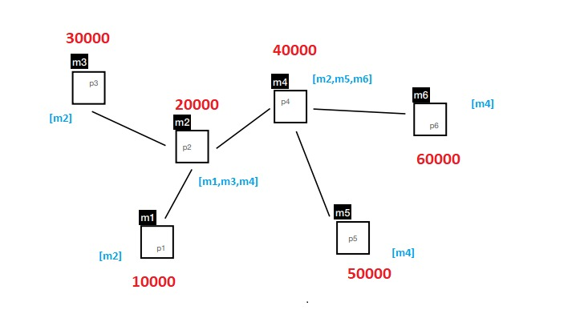

# Duvidas

+ No trabalho 2, quando um peer atualiza o seu mapa (faze um pedido de sincronizacao), com outro peer, no final temos o mesmo mapa em ambos os peers??? 

>R: Sim

+ Long chega para representar o timestamp certo?

> R:Sim

+ Os peer's que nao estao diretamente conectados conhecem-se apenas pela 'partilha' de mapas

> R:sim

+ Quando inicializamos um Peer e respetivos vizinhos  podemos colocar os vizinhos automaticamente no seu mapa de vizinho com respetivo timestamp atual? ( mesmo nao ter  feito qualquer conexao previa a esse vizinho)

+ Quando um peer recebe outro peer que nao e seu vizinho direto, ele pode enviar pedidos de sincronizacao, certo?

+ Qual seria um threshold valido para remover um peer? (tem de ser um alto o suficiente para nao remover um peer por engano)


+ Apos a remocao de um peer da rede, e suposto que o mesmo se possa conectar novamente a rede certo? (precisso verificar se isto acontece, mas penso que da maneira como tenho a aplicao a fazer as coisas isto ja deve acontecer sem ser precisso fazer nada, mas e necessario testa isto!!)

# Observacoes
> Anti-entropy: Each replica regularly chooses another replica at random,
and exchanges state differences, leading to identical states at both
afterwards



> Ja fiz teste com 6 peer's e de momento nao ocorre nao acontecerem ```erros de Concorrencia``` explicitamente


# Todo

1. Mostrar ao professor o funcionamento com o exemplo de 3 Peer's (para ser mais simples).Eu fiz alguns testes e parecia bem, mas pedir para dar uma vista de olhos nos logs (apos deixar o script a correr durante um pouco)

2. Adicionar a remocao de um peer apos um certo threshold ser verificado


3. Testar nas maquinas do laboratorio

4. Perguntar se o terceiro trabalho se tem algum " exercicio exemplo"  para o terceiro trabalho, ou se algum dos exercicios que fizemos se assemelha.

5. Restrutar o README para indicar como e que se corre o programa