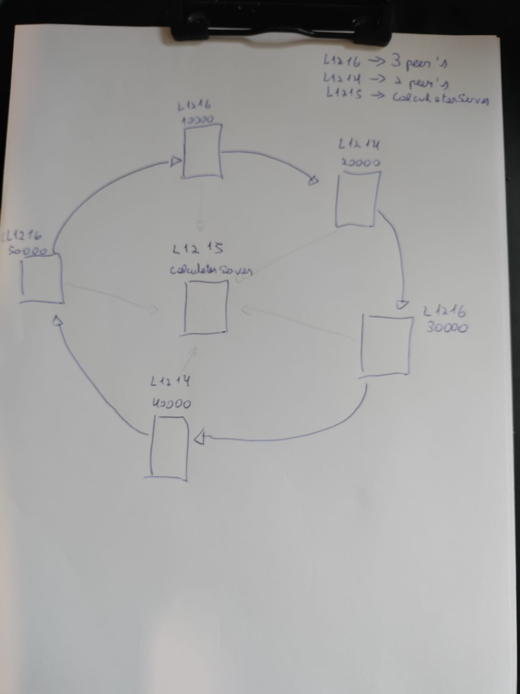

# TODO (o que falta para completar este trabalho)

+ Testar com maquinas do laboratorio (um peer em cada maquina)

+ Cada peer deve ter associado um TIMEOUT em que se o timeout for atingido (nao recebeu
um Token num certo intervalo de tempo) deve desligar-se

+ Tratar das excessoes (como peer nao ligado ou desligou-se, e por uma mensagem e dizer que nao esta ligado, invez de aparece excessao)

+ Testar se a rede funciona caso um peer se deligue e depois volte se a ligar

# Comandos para testar no laboratorio

>**Nota**: segui o seguinte esquema para simular o toke ring

+ No diretorio  (...)/Sistemas_Distribuidos, compilar 

         $ javac ds/assign/ring/*.java

+ Executar o CalculatorMultiServer (porta default e 44444)

        SEM GUARDAR LOGS NUM FICHEIRO
        $ java ds.assign.ring.CalculatorMultiServer l1215

        COM GUARDAR LOGS NUM FICHEIRO
        $ java ds.assign.ring.CalculatorMultiServer l1215 > ds/assign/ring/logs/CalculatorServer.txt

+ Executar os Peer's (o utimo parametro representa o host calculator server)
        
        Peer_1 $ java ds.assign.ring.Peer l1216 10000 l1214 20000 l1215

        Peer_2 $ java ds.assign.ring.Peer l1214 20000 l1216 30000 l1215

        Peer_3 $ java ds.assign.ring.Peer l1216 30000 l1214 40000 l1215

        Peer_4 $ java ds.assign.ring.Peer l1214 40000 l1216 50000 l1215

        Peer_5 $ java ds.assign.ring.Peer l1216 50000 l1216 10000 l1215

+ Injetar o Token num dos peers 

             $ java ds.assign.ring.Token l1216 10000

  
# Como correr o progama (exemplo)

+ No diretorio  (...)/Sistemas_Distribuidos, compilar

****

    $ javac ds/assign/ring/*.java

+ Executar o CalculatorMultiServer (porta default e 44444)

**** 

    $ java ds.assign.ring.CalculatorMultiServer localhost

+ Executar os Peer's (o utimo parametro representa o host calculator server)
                
****   

    Peer_1 $ java ds.assign.ring.Peer localhost 10000 localhost 20000 localhost

    Peer_2 $ java ds.assign.ring.Peer localhost 20000 localhost 30000 localhost

    Peer_3 $ java ds.assign.ring.Peer localhost 30000 localhost 40000 localhost

    Peer_4 $ java ds.assign.ring.Peer localhost 40000 localhost 50000 localhost

    Peer_5 $ java ds.assign.ring.Peer localhost 50000 localhost 10000 localhost

+ Injetar o Token num dos peers 

**** 

    $ java ds.assign.ring.Token localhost 10000 

## Versao com script (so funciona se  todos os peer estao a correr na mesma maquina)

    terminal_1$ pwd 
    (...)/Sistemas_Distribuidos

    terminal_1$ javac ds/assign/ring/*.java  

    terminal_1$ ./ds/assign/ring/scripts/run.sh 

    terminal_1$ java ds.assign.ring.Token localhost 10000

## Verificar logs de CalculatorMultiServer 

    Ver ficheiro /logs/CalculatorServer.txt

### Para obter logs de CalculatorMultiServer de um Peer especifico (dado a @Port do mesmo)

    terminal_1$ pwd 
    (...)/Sistemas_Distribuidos

    terminal_1$ ./ds/assign/ring/scripts/extract_messages.sh nr_porta

    ver ficheiro /out/nr_porta

### Para verificar se existem pedidos repetidos nos ficheiros /out/nr_porta

    terminal_1$ pwd 
    (...)/Sistemas_Distribuidos

    # A opção -c prefixa cada linha com o número de ocorrências na entrada:
    terminal_1$ uniq -c ds/assign/ring/out/nr_porta.txt 
